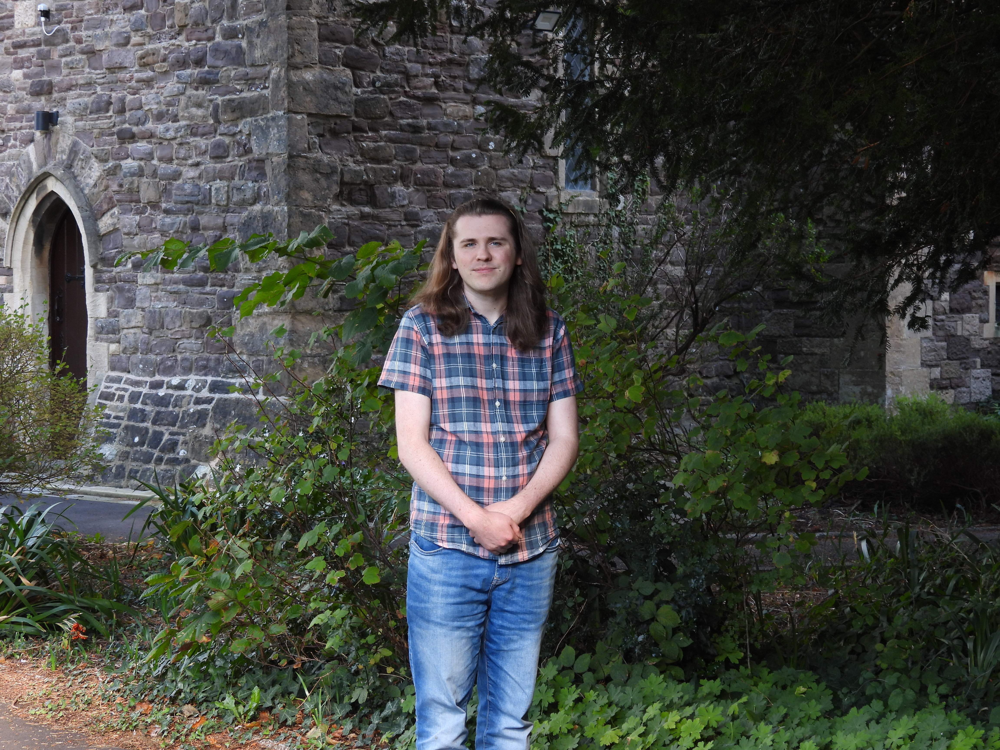

{.nolightbox}

# Bio

I am a recent Ph.D. graduate from McMaster University's [MAPLE Lab](https://maplelab.net/) in Canada. My main research interests are in psychoacoustics, music cognition and human factors. More specifically, I have conducted and contributed to research exploring how insights from music and psychoacoustics informs our design of safety-critical alert sounds, ranging from bicycle bells to medical devices. As a musician growing up with an interest in science, knowing I could conduct research into sound while applying it to all-important issues of peoples' wellbeing has been immensely satisfying. Beyond my research, I love all things music - I play trumpet, piano, and sing in choirs!

## My projects

::: {layout-ncol=2}

My research career began at the University of Plymouth, England. I undertook a research assistantship with [Dr. Judy Edworthy](https://en.wikipedia.org/wiki/Judy_Edworthy), where I first became acquainted with research into the design of auditory alerts. I completed my Bachelors and Masters thesis with her; the former focused on sounds in the [chemical refinery industries](https://www.tandfonline.com/doi/abs/10.1080/24725838.2021.2012730), the latter on design of [digital bike bells](https://journals.sagepub.com/doi/abs/10.1177/21695067231192480). The results from the study of bike bells ultimately influenced the design of a recently released digital bike bell from the globally prolific Trek bikes company.

::: {.vidcap}



A video from Trek demonstrating their scientifically-informed bell!

:::

:::

\

::: {layout-ncol=2}

::: {.vidcap}

<iframe src="https://globalnews.ca/video/embed/9515334/" width="390" height="219" frameborder="0" allowfullscreen scrolling="no"></iframe>

I featured in a news piece by Global News Toronto on the MAPLE Lab's alarms research

:::

Given the fulfilment I had from research into auditory alerts, I was delighted to join the MAPLE Lab, under the supervision of [Dr. Michael Schutz](https://en.wikipedia.org/wiki/Michael_Schutz_(professor)). My research contributed to the lab's project of taking a musically-informed approach to improving alarm efficacy in hospitals. I focused on comparing perception between sounds of differing timbre, finding whether a piano-like 'percussive' timbre could be of benefit in sound design. In combination with other studies from our lab, we set up a strong case for percussive sounds being easier to detect and less aversive for hospital staff.

:::

To see my work in greater depth, take a look at my [<u>publications</u>](cv.qmd#publications)!

## Future

During the course of my studies, I came to be fascinated by the quantitative methods used as part of the scientific method. I became especially intrigued by the use of Bayesian inference for deriving logically sensible conclusions from data (which I employed as part of my Ph.D. thesis). Consequently, I am now transitioning into data science, such that I can focus on handling data, and the art of deciding how to analyse and present it. 

# Song of the Week

Check in each week for a new song of the week, as selected by me! This is mostly just a bit of fun, but music can also give some insight into a person not otherwise visible.

\

